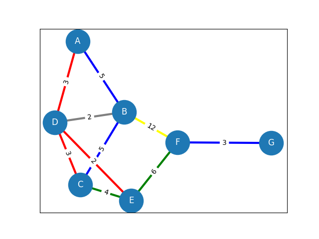
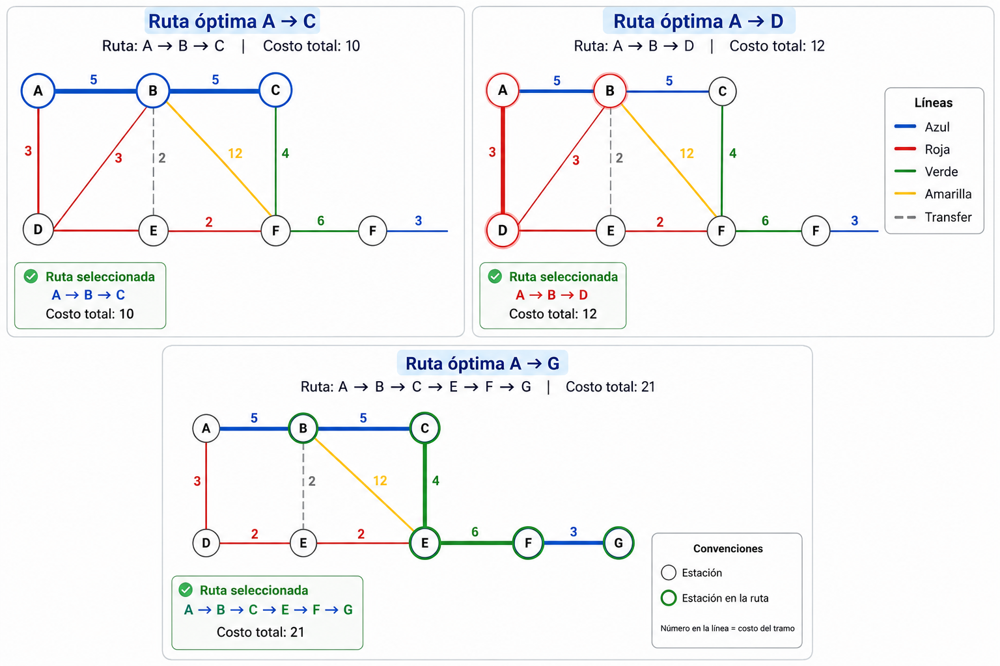

# Inteligencia-Artificial

Descripción
-----------

Este repositorio contiene un ejemplo didáctico de búsqueda de rutas en un grafo de transporte usando A* combinado con una pequeña base de conocimiento (reglas) que modifica los costos de las conexiones.

Qué hace el programa
---------------------

- Define un grafo de transporte (`TransportGraph`) donde cada arista tiene un costo y una línea (por ejemplo `azul`, `roja`, `transfer`).
- Implementa una `KnowledgeBase` simple que permite añadir reglas que transforman el costo de una arista (por ejemplo penalizar transbordos o evitar líneas congestionadas).
- Implementa un algoritmo A* básico (`a_star`) que utiliza la base de conocimiento para ajustar costos y busca la ruta de menor costo entre dos nodos.

Grafos
---

Ejercicios usados
---

Cómo usarlo
----------

1. Abrir el notebook [Inteligencia-Artificial/Actividad_2_Búsqueda_y_sistemas_basados_en_reglas.ipynb](Inteligencia-Artificial/Actividad_2_Búsqueda_y_sistemas_basados_en_reglas.ipynb) en Jupyter Notebook o JupyterLab.
2. Ejecutar las celdas de arriba a abajo. En la última celda hay un ejemplo que crea un grafo ampliado con varios nodos y muestra rutas ejemplo (A->C, A->D, A->G).

Notas
-----

- El notebook incluye funciones de ejemplo para penalizar transbordos y evitar líneas congestionadas; puedes añadir reglas nuevas con `kb.add_rule(mi_regla)`.
 - Si prefieres ejecutar como script, exporta la celda principal a un `.py` y ejecútalo con `python`.

- Reglas adicionales incluidas:
    - `verde`: se aplica un sesgo favorable (bias) que reduce ligeramente el costo; está implementada como `favorecer_linea_verde` y disminuye el costo en 1 unidad (sin llegar a negativo).
    - `amarilla`: representa zonas de construcción y se penaliza aumentando el costo (implementada como `penalizar_linea_construccion`, añade +8 al costo).

